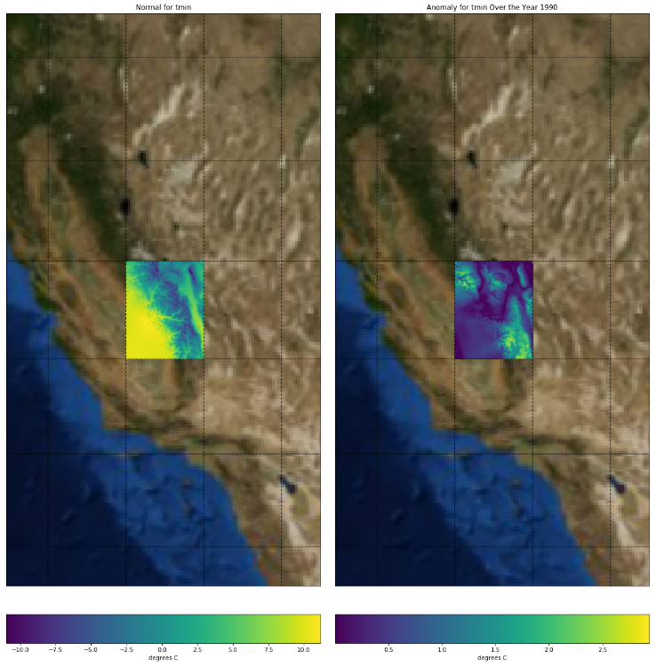

# Plotting Normals and Anomalies for `Daymet` Data
##### Keywords:  ORNL DAAC, Daymet, weather estimates, Anomalies, Normals, THREDDS, OPeNDAP, Earthdata, `pydap`

## Overview
In this tutorial, we will explore using the `pydap` package to plot `Daymet` data. Specifically, we will calculate anomalies and normals for a weather estimate such as `tmin`, `tmax`, and `prcp`. To learn more about how to use Jupyter Notebooks, check out this [`YouTube` video](https://www.youtube.com/watch?v=JImOfVHQtYc).



## Source Data
A spatial subset of the North American Daymet dataset daily data; https://daymet.ornl.gov . In this example, we will access the data from [this ORNL DAAC's THREDDS server.](https://thredds.daac.ornl.gov/thredds/catalogs/ornldaac/Regional_and_Global_Data/DAYMET_COLLECTIONS/DAYMET_COLLECTIONS.html)

## Prerequisites:
Python 2.7 or greater. Python modules: `pydap`, `basemap`, `matplotlib`. To run this notebook locally, you will also need:
`iPython`, `ipywidgets`, `jupyter`. Requirements are also in [requirements.txt](requirements.txt)

## Installing
For scientific computing, [anaconda](https://conda.io/docs/user-guide/install/index.html) is recommended as it come pre-installed with packages such as *numpy*, *iPython*, and *matplotlib*.

Most operating systems, however, come with Python. To install the necessary python libraries, you can copy the [requirements.txt](https://raw.githubusercontent.com/ornldaac/daymet_normals_anomalies_years/master/requirements.txt) from this repository and run:

```bash
pip install -r requirements.txt
```

## Tutorial
In [this notebook](https://github.com/ornldaac/daymet_normals_anomalies_years/blob/master/daymet_normals_anomalies_yearly_tiles.ipynb), the Daymet data is separated by year rather than aggregated into one tile.
